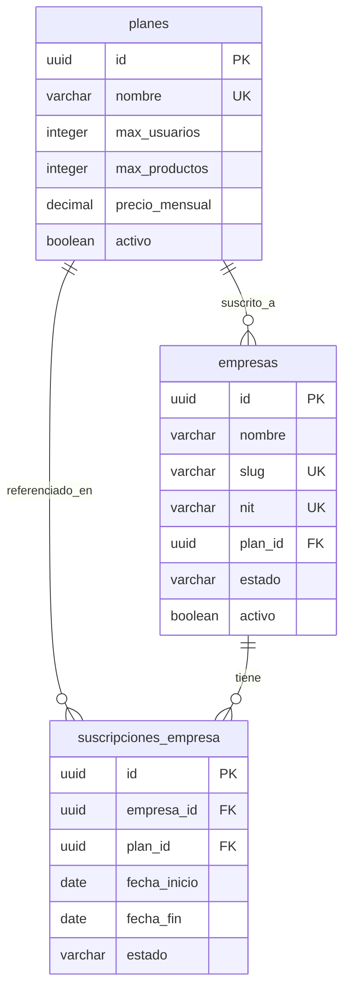
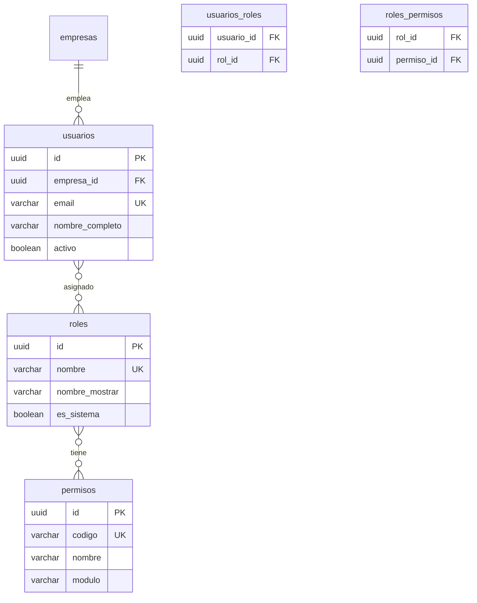
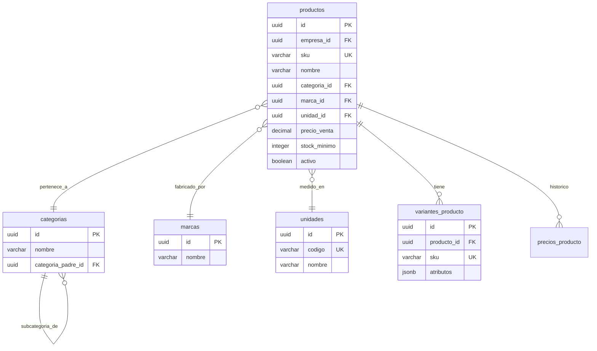
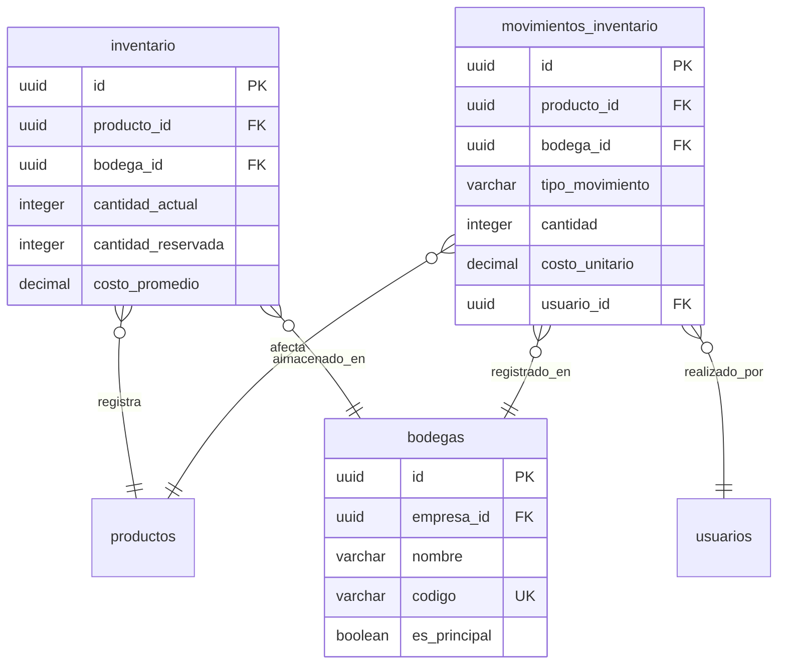
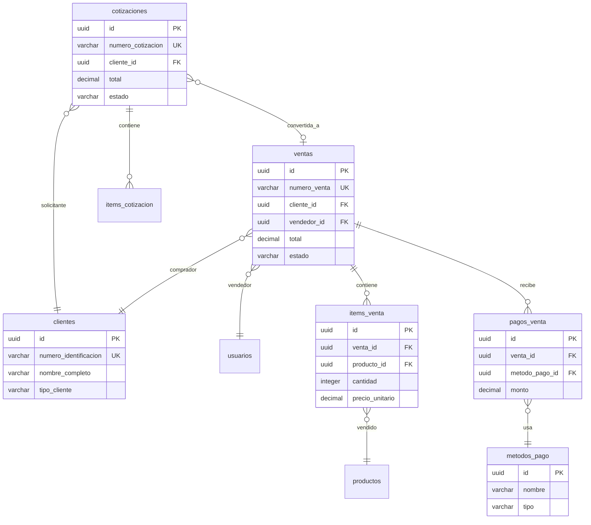
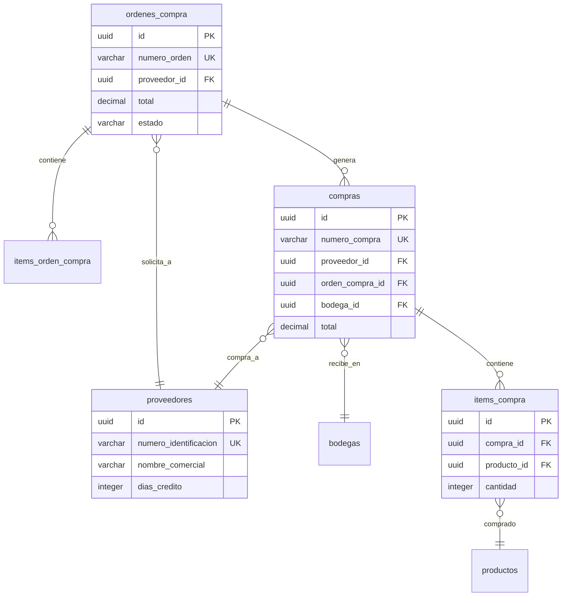
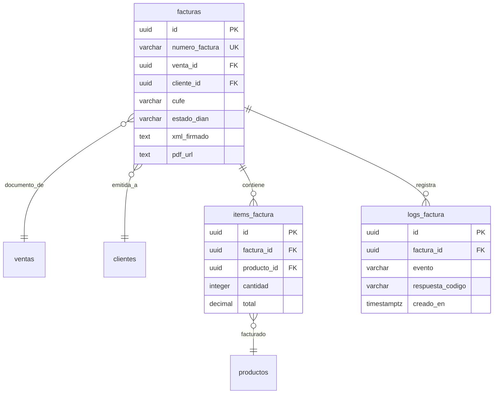

# 📊 Diagrama Entidad-Relación - Sistema de Gestión de Ferretería

## Índice
1. [Diagrama ER Completo](#diagrama-er-completo)
2. [Diagramas por Módulo](#diagramas-por-módulo)
3. [Leyenda de Relaciones](#leyenda-de-relaciones)
4. [Notas Importantes](#notas-importantes)

---

## Diagrama ER Completo

```mermaid
erDiagram
    %% ========================================
    %% GESTIÓN DE PLANES Y EMPRESAS (SAAS)
    %% ========================================
    
    planes ||--o{ empresas : "tiene"
    planes {
        uuid id PK
        varchar nombre UK
        varchar nombre_mostrar
        text descripcion
        integer max_usuarios
        integer max_productos
        integer max_facturas_por_mes
        integer max_bodegas
        integer max_almacenamiento_mb
        jsonb caracteristicas
        decimal precio_mensual
        decimal precio_anual
        boolean activo
        timestamptz creado_en
        timestamptz actualizado_en
    }
    
    empresas ||--o{ suscripciones_empresa : "tiene"
    empresas ||--o{ usuarios : "tiene"
    empresas ||--o{ productos : "tiene"
    empresas ||--o{ clientes : "tiene"
    empresas ||--o{ proveedores : "tiene"
    empresas ||--o{ bodegas : "tiene"
    empresas ||--o{ ventas : "tiene"
    empresas ||--o{ compras : "tiene"
    empresas {
        uuid id PK
        varchar nombre
        varchar nombre_legal
        varchar slug UK
        varchar nit UK
        varchar tipo_identificacion
        varchar email
        varchar telefono
        varchar sitio_web
        text direccion
        varchar ciudad
        varchar departamento
        varchar pais
        varchar codigo_postal
        varchar moneda
        varchar zona_horaria
        varchar idioma
        uuid plan_id FK
        text logo_url
        varchar estado
        boolean activo
        jsonb configuracion
        boolean factura_electronica_habilitada
        jsonb factura_electronica_config
        timestamptz creado_en
        timestamptz actualizado_en
    }
    
    suscripciones_empresa {
        uuid id PK
        uuid empresa_id FK
        uuid plan_id FK
        date fecha_inicio
        date fecha_fin
        varchar estado
        decimal precio_pagado
        varchar metodo_pago
        text notas
        timestamptz creado_en
        timestamptz actualizado_en
    }
    
    %% ========================================
    %% GESTIÓN DE USUARIOS Y PERMISOS
    %% ========================================
    
    usuarios ||--o{ usuarios_roles : "tiene"
    usuarios ||--o{ ventas : "realiza"
    usuarios ||--o{ compras : "realiza"
    usuarios ||--o{ ajustes_inventario : "realiza"
    usuarios ||--o{ logs_auditoria : "genera"
    usuarios {
        uuid id PK
        uuid empresa_id FK
        varchar email UK
        varchar nombre_completo
        varchar telefono
        text avatar_url
        varchar estado
        boolean activo
        varchar idioma_preferido
        jsonb configuracion
        timestamptz ultimo_acceso
        timestamptz creado_en
        timestamptz actualizado_en
    }
    
    roles ||--o{ usuarios_roles : "asignado_a"
    roles ||--o{ roles_permisos : "tiene"
    roles {
        uuid id PK
        varchar nombre UK
        varchar nombre_mostrar
        text descripcion
        boolean es_sistema
        boolean activo
        timestamptz creado_en
        timestamptz actualizado_en
    }
    
    permisos ||--o{ roles_permisos : "pertenece_a"
    permisos {
        uuid id PK
        varchar codigo UK
        varchar nombre
        varchar modulo
        text descripcion
        timestamptz creado_en
    }
    
    usuarios_roles {
        uuid id PK
        uuid usuario_id FK
        uuid rol_id FK
        boolean activo
        timestamptz asignado_en
    }
    
    roles_permisos {
        uuid id PK
        uuid rol_id FK
        uuid permiso_id FK
        timestamptz creado_en
    }
    
    %% ========================================
    %% GESTIÓN DE PRODUCTOS
    %% ========================================
    
    categorias ||--o{ productos : "clasifica"
    categorias ||--o{ categorias : "subcategoria_de"
    marcas ||--o{ productos : "fabrica"
    unidades ||--o{ productos : "mide"
    
    categorias {
        uuid id PK
        uuid empresa_id FK
        varchar nombre
        varchar codigo UK
        text descripcion
        uuid categoria_padre_id FK
        text icono
        integer orden
        boolean activo
        timestamptz creado_en
        timestamptz actualizado_en
    }
    
    marcas {
        uuid id PK
        uuid empresa_id FK
        varchar nombre
        text descripcion
        text logo_url
        boolean activo
        timestamptz creado_en
        timestamptz actualizado_en
    }
    
    unidades {
        uuid id PK
        varchar codigo UK
        varchar nombre
        varchar abreviacion
        varchar tipo
        boolean es_sistema
        timestamptz creado_en
        timestamptz actualizado_en
    }
    
    productos ||--o{ variantes_producto : "tiene"
    productos ||--o{ precios_producto : "tiene_historico"
    productos ||--o{ inventario : "registra_stock"
    productos ||--o{ items_venta : "vendido_en"
    productos ||--o{ items_compra : "comprado_en"
    productos {
        uuid id PK
        uuid empresa_id FK
        varchar sku UK
        varchar codigo_barras
        varchar nombre
        text descripcion
        uuid categoria_id FK
        uuid marca_id FK
        uuid unidad_id FK
        varchar tipo_producto
        boolean es_variante_multiple
        decimal precio_venta
        decimal precio_compra
        decimal costo_promedio
        integer stock_minimo
        integer stock_maximo
        boolean control_inventario
        text imagen_url
        jsonb especificaciones
        boolean activo
        timestamptz creado_en
        timestamptz actualizado_en
        timestamptz eliminado_en
    }
    
    variantes_producto {
        uuid id PK
        uuid producto_id FK
        varchar sku UK
        varchar nombre_variante
        jsonb atributos
        decimal precio_adicional
        integer stock
        boolean activo
        timestamptz creado_en
        timestamptz actualizado_en
    }
    
    precios_producto {
        uuid id PK
        uuid producto_id FK
        decimal precio_compra
        decimal precio_venta
        decimal margen_porcentaje
        date fecha_vigencia
        timestamptz creado_en
    }
    
    %% ========================================
    %% GESTIÓN DE INVENTARIO
    %% ========================================
    
    bodegas ||--o{ inventario : "almacena"
    bodegas ||--o{ movimientos_inventario : "registra"
    bodegas {
        uuid id PK
        uuid empresa_id FK
        varchar nombre
        varchar codigo UK
        text descripcion
        text direccion
        varchar ciudad
        varchar telefono
        varchar tipo
        boolean es_principal
        boolean activo
        timestamptz creado_en
        timestamptz actualizado_en
    }
    
    inventario ||--o{ movimientos_inventario : "genera"
    inventario {
        uuid id PK
        uuid empresa_id FK
        uuid producto_id FK
        uuid variante_id FK
        uuid bodega_id FK
        integer cantidad_actual
        integer cantidad_reservada
        integer cantidad_disponible
        decimal costo_promedio
        timestamptz ultima_entrada
        timestamptz ultima_salida
        timestamptz actualizado_en
    }
    
    movimientos_inventario {
        uuid id PK
        uuid empresa_id FK
        uuid producto_id FK
        uuid variante_id FK
        uuid bodega_id FK
        varchar tipo_movimiento
        integer cantidad
        integer cantidad_anterior
        integer cantidad_nueva
        decimal costo_unitario
        decimal costo_total
        varchar tipo_transaccion
        uuid referencia_id
        text notas
        uuid usuario_id FK
        timestamptz creado_en
    }
    
    ajustes_inventario {
        uuid id PK
        uuid empresa_id FK
        uuid bodega_id FK
        varchar tipo_ajuste
        text motivo
        varchar estado
        uuid aprobado_por FK
        timestamptz fecha_aprobacion
        uuid creado_por FK
        timestamptz creado_en
        timestamptz actualizado_en
    }
    
    %% ========================================
    %% GESTIÓN DE CLIENTES Y PROVEEDORES
    %% ========================================
    
    clientes ||--o{ ventas : "realiza"
    clientes ||--o{ cotizaciones : "solicita"
    clientes {
        uuid id PK
        uuid empresa_id FK
        varchar tipo_persona
        varchar numero_identificacion UK
        varchar tipo_identificacion
        varchar nombre_completo
        varchar nombre_comercial
        varchar email
        varchar telefono
        varchar celular
        text direccion
        varchar ciudad
        varchar departamento
        varchar pais
        varchar tipo_cliente
        decimal limite_credito
        integer dias_credito
        boolean activo
        text notas
        timestamptz creado_en
        timestamptz actualizado_en
        timestamptz eliminado_en
    }
    
    proveedores ||--o{ ordenes_compra : "recibe"
    proveedores ||--o{ compras : "provee"
    proveedores {
        uuid id PK
        uuid empresa_id FK
        varchar numero_identificacion UK
        varchar tipo_identificacion
        varchar nombre_comercial
        varchar nombre_legal
        varchar email
        varchar telefono
        varchar celular
        text direccion
        varchar ciudad
        varchar departamento
        varchar pais
        varchar persona_contacto
        integer dias_credito
        decimal limite_credito
        boolean activo
        text notas
        timestamptz creado_en
        timestamptz actualizado_en
        timestamptz eliminado_en
    }
    
    %% ========================================
    %% GESTIÓN DE VENTAS
    %% ========================================
    
    ventas ||--o{ items_venta : "contiene"
    ventas ||--o{ pagos_venta : "registra_pago"
    ventas ||--o{ facturas : "genera"
    ventas {
        uuid id PK
        uuid empresa_id FK
        varchar numero_venta UK
        date fecha_venta
        time hora_venta
        uuid cliente_id FK
        uuid vendedor_id FK
        varchar tipo_venta
        decimal subtotal
        decimal descuento_porcentaje
        decimal descuento_monto
        decimal impuesto_porcentaje
        decimal impuesto_monto
        decimal total
        varchar estado
        varchar metodo_pago
        text notas
        timestamptz creado_en
        timestamptz actualizado_en
    }
    
    items_venta {
        uuid id PK
        uuid venta_id FK
        uuid producto_id FK
        uuid variante_id FK
        integer cantidad
        decimal precio_unitario
        decimal descuento_porcentaje
        decimal descuento_monto
        decimal subtotal
        decimal impuesto_porcentaje
        decimal impuesto_monto
        decimal total
        timestamptz creado_en
    }
    
    metodos_pago ||--o{ pagos_venta : "usado_en"
    metodos_pago {
        uuid id PK
        uuid empresa_id FK
        varchar nombre
        varchar tipo
        boolean requiere_referencia
        boolean activo
        timestamptz creado_en
        timestamptz actualizado_en
    }
    
    pagos_venta {
        uuid id PK
        uuid venta_id FK
        uuid metodo_pago_id FK
        decimal monto
        varchar referencia
        date fecha_pago
        timestamptz creado_en
    }
    
    cotizaciones ||--o{ items_cotizacion : "contiene"
    cotizaciones {
        uuid id PK
        uuid empresa_id FK
        varchar numero_cotizacion UK
        date fecha_cotizacion
        date fecha_validez
        uuid cliente_id FK
        uuid vendedor_id FK
        decimal subtotal
        decimal descuento_porcentaje
        decimal descuento_monto
        decimal impuesto_porcentaje
        decimal impuesto_monto
        decimal total
        varchar estado
        text notas
        uuid venta_id FK
        timestamptz creado_en
        timestamptz actualizado_en
    }
    
    items_cotizacion {
        uuid id PK
        uuid cotizacion_id FK
        uuid producto_id FK
        uuid variante_id FK
        integer cantidad
        decimal precio_unitario
        decimal descuento_porcentaje
        decimal descuento_monto
        decimal subtotal
        decimal impuesto_porcentaje
        decimal impuesto_monto
        decimal total
        timestamptz creado_en
    }
    
    %% ========================================
    %% GESTIÓN DE COMPRAS
    %% ========================================
    
    ordenes_compra ||--o{ items_orden_compra : "contiene"
    ordenes_compra ||--o{ compras : "genera"
    ordenes_compra {
        uuid id PK
        uuid empresa_id FK
        varchar numero_orden UK
        date fecha_orden
        date fecha_entrega_esperada
        uuid proveedor_id FK
        uuid solicitado_por FK
        decimal subtotal
        decimal descuento_monto
        decimal impuesto_monto
        decimal total
        varchar estado
        text notas
        timestamptz creado_en
        timestamptz actualizado_en
    }
    
    items_orden_compra {
        uuid id PK
        uuid orden_compra_id FK
        uuid producto_id FK
        integer cantidad_solicitada
        integer cantidad_recibida
        decimal precio_unitario
        decimal subtotal
        decimal impuesto_monto
        decimal total
        timestamptz creado_en
    }
    
    compras ||--o{ items_compra : "contiene"
    compras {
        uuid id PK
        uuid empresa_id FK
        varchar numero_compra UK
        varchar factura_proveedor
        date fecha_compra
        date fecha_recepcion
        uuid proveedor_id FK
        uuid orden_compra_id FK
        uuid bodega_id FK
        uuid recibido_por FK
        decimal subtotal
        decimal descuento_monto
        decimal impuesto_monto
        decimal total
        varchar estado
        text notas
        timestamptz creado_en
        timestamptz actualizado_en
    }
    
    items_compra {
        uuid id PK
        uuid compra_id FK
        uuid producto_id FK
        uuid variante_id FK
        integer cantidad
        decimal precio_unitario
        decimal subtotal
        decimal impuesto_monto
        decimal total
        timestamptz creado_en
    }
    
    %% ========================================
    %% FACTURACIÓN ELECTRÓNICA
    %% ========================================
    
    facturas ||--o{ items_factura : "contiene"
    facturas ||--o{ logs_factura : "registra"
    facturas {
        uuid id PK
        uuid empresa_id FK
        varchar numero_factura UK
        varchar prefijo
        integer consecutivo
        date fecha_emision
        time hora_emision
        uuid venta_id FK
        uuid cliente_id FK
        varchar tipo_factura
        decimal subtotal
        decimal descuento_monto
        decimal impuesto_monto
        decimal total
        varchar estado
        varchar cufe
        varchar codigo_qr
        text xml_firmado
        text pdf_url
        date fecha_envio_dian
        varchar estado_dian
        text respuesta_dian
        timestamptz creado_en
        timestamptz actualizado_en
    }
    
    items_factura {
        uuid id PK
        uuid factura_id FK
        uuid producto_id FK
        integer cantidad
        decimal precio_unitario
        decimal descuento_monto
        decimal subtotal
        decimal impuesto_monto
        decimal total
        timestamptz creado_en
    }
    
    logs_factura {
        uuid id PK
        uuid factura_id FK
        varchar evento
        text descripcion
        jsonb payload
        varchar respuesta_codigo
        text respuesta_mensaje
        timestamptz creado_en
    }
    
    %% ========================================
    %% AUDITORÍA
    %% ========================================
    
    logs_auditoria {
        uuid id PK
        uuid empresa_id FK
        uuid usuario_id FK
        varchar accion
        varchar entidad
        uuid entidad_id
        jsonb datos_anteriores
        jsonb datos_nuevos
        varchar ip_address
        varchar user_agent
        timestamptz creado_en
    }
```

---

## Diagramas por Módulo

### 1. Gestión de Planes y Tenants (SaaS)

### 2. Gestión de Usuarios y Permisos (RBAC)

### 3. Gestión de Productos

### 4. Gestión de Inventario (Kardex)

### 5. Gestión de Ventas

### 6. Gestión de Compras

### 7. Facturación Electrónica

---

## Leyenda de Relaciones

### Cardinalidad
- `||--||` : Uno a Uno (1:1)
- `||--o{` : Uno a Muchos (1:N)
- `}o--o{` : Muchos a Muchos (N:M)
- `}o--||` : Muchos a Uno (N:1)

### Tipos de Líneas
- Línea continua: Relación obligatoria
- Línea punteada: Relación opcional

### Claves
- `PK` : Clave Primaria (Primary Key)
- `FK` : Clave Foránea (Foreign Key)
- `UK` : Clave Única (Unique Key)

---

## Notas Importantes

### 1. Multi-Tenancy
Todas las tablas principales incluyen `empresa_id` (tenant_id) para aislar datos entre ferreterías. Las excepciones son:
- `planes` - Tabla global de planes
- `permisos` - Tabla global de permisos del sistema
- `roles` - Roles compartidos (Admin, Vendedor, etc.)
- `unidades` - Unidades de medida globales

### 2. Soft Delete
Las siguientes tablas implementan soft delete con `eliminado_en`:
- `productos`
- `clientes`
- `proveedores`

### 3. Auditoría
Todas las tablas incluyen:
- `creado_en` - Timestamp de creación
- `actualizado_en` - Timestamp de última actualización

### 4. JSONB
Se usa JSONB para datos flexibles:
- `configuracion` en empresas
- `caracteristicas` en planes
- `atributos` en variantes de productos
- `especificaciones` en productos
- `factura_electronica_config` en empresas

### 5. Row Level Security (RLS)
Todas las tablas multi-tenant deben tener políticas RLS configuradas en Supabase para garantizar el aislamiento de datos.

### 6. Índices Importantes
Los índices compuestos recomendados incluyen:
- `(empresa_id, sku)` en productos
- `(empresa_id, numero_venta)` en ventas
- `(empresa_id, fecha_venta)` en ventas
- `(empresa_id, producto_id, bodega_id)` en inventario
- `(empresa_id, numero_identificacion)` en clientes y proveedores

### 7. Integridad Referencial
Todas las claves foráneas tienen:
- `ON DELETE RESTRICT` por defecto
- Excepciones con `ON DELETE CASCADE` solo en tablas de detalle (items_venta, items_compra)

---

## Visualización Online

Para visualizar estos diagramas de forma interactiva:

1. **Mermaid Live Editor**: https://mermaid.live/
   - Copiar el código Mermaid
   - Pegar en el editor
   - Visualizar y exportar como PNG/SVG

2. **VS Code con extensión Mermaid**:
   - Instalar extensión "Markdown Preview Mermaid Support"
   - Abrir este archivo en VS Code
   - Vista previa de Markdown (Ctrl+Shift+V)

3. **GitHub/GitLab**:
   - Los bloques Mermaid se renderizan automáticamente en README.md

---

## Estadísticas del Diseño

- **Total de tablas**: 42
- **Tablas multi-tenant**: 35 (con `empresa_id`)
- **Tablas globales**: 7
- **Relaciones 1:N**: 58+
- **Relaciones N:M**: 2 (usuarios_roles, roles_permisos)
- **Campos con índice**: 35+
- **Tablas con soft delete**: 3
- **Tablas con auditoría completa**: 42 (todas)

---

**Última actualización**: 2026-02-11
**Versión**: 2.0.0
