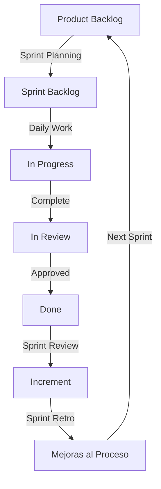

# 🏃 Guía de Scrum - Sistema de Gestión de Ferretería

Esta guía explica cómo aplicamos la metodología Scrum en nuestro proyecto de código abierto.

## 📋 Tabla de Contenidos

- [¿Qué es Scrum?](#qué-es-scrum)
- [Roles en Scrum](#roles-en-scrum)
- [Eventos de Scrum](#eventos-de-scrum)
- [Artefactos de Scrum](#artefactos-de-scrum)
- [Flujo de Trabajo](#flujo-de-trabajo)
- [Cómo Participar](#cómo-participar)
- [Herramientas](#herramientas)

## 🎯 ¿Qué es Scrum?

Scrum es un marco de trabajo ágil que nos ayuda a:

- ✅ Entregar valor de forma incremental
- ✅ Adaptarnos rápidamente a cambios
- ✅ Trabajar en equipo de forma colaborativa
- ✅ Mejorar continuamente nuestro proceso

### Principios Clave

1. **Transparencia**: Todo el trabajo es visible para todos
2. **Inspección**: Revisamos constantemente nuestro progreso
3. **Adaptación**: Ajustamos nuestro plan según aprendemos

## 👥 Roles en Scrum

### Product Owner
**Responsable**: [@Deibyd07](https://github.com/Deibyd07)

**Responsabilidades**:
- Define la visión del producto
- Gestiona el Product Backlog
- Prioriza las funcionalidades
- Acepta o rechaza el trabajo completado
- Representa a los stakeholders

**Cómo interactuar**:
- Participa en Discussions para proponer features
- Comenta en issues del Product Backlog
- Asiste al Sprint Planning y Sprint Review

### Scrum Master
**Responsable**: [Por definir en cada Sprint]

**Responsabilidades**:
- Facilita los eventos de Scrum
- Remueve impedimentos del equipo
- Protege al equipo de distracciones
- Asegura que se siga el proceso
- Ayuda al equipo a mejorar

**Cómo interactuar**:
- Reporta impedimentos como issues con label `impediment`
- Solicita ayuda en Discussions
- Participa en retrospectivas

### Development Team
**Todos los contribuyentes del proyecto (¡TÚ!)**

**Responsabilidades**:
- Implementa las funcionalidades
- Escribe tests y documentación
- Revisa Pull Requests
- Participa en los eventos de Scrum
- Auto-organiza su trabajo

**Cómo participar**:
- Elige tareas del Sprint Backlog
- Actualiza el progreso de tus issues
- Colabora con otros desarrolladores
- Comparte conocimiento

## 📅 Eventos de Scrum

### 1. Sprint

**Duración**: 2 semanas
**Frecuencia**: Continuo

Un Sprint es un período de tiempo fijo donde el equipo trabaja para completar un conjunto de objetivos.

**Características**:
- ⏱️ **Duración fija**: 2 semanas, del lunes al domingo
- 🎯 **Objetivo claro**: Definido en Sprint Planning
- 🚫 **Sin cambios**: No se agregan nuevos requisitos durante el Sprint
- ✅ **Entregable**: Debe producir un incremento funcional

**Calendario de Sprints 2026**:
```
Sprint 1:  Feb 10 - Feb 23
Sprint 2:  Feb 24 - Mar 09
Sprint 3:  Mar 10 - Mar 23
Sprint 4:  Mar 24 - Apr 06
... (continúa)
```

### 2. Sprint Planning

**Cuándo**: Primer día del Sprint (lunes)
**Duración**: 2-4 horas (async en GitHub Discussions)
**Quién**: Todo el equipo

**Objetivo**: Planificar el trabajo del Sprint

**Agenda**:

1. **Parte 1: ¿Qué vamos a hacer?** (1-2 horas)
   - Product Owner presenta prioridades del Product Backlog
   - Equipo pregunta y aclara dudas
   - Equipo selecciona issues para el Sprint
   - Se define el Sprint Goal

2. **Parte 2: ¿Cómo lo vamos a hacer?** (1-2 horas)
   - Equipo descompone issues en tareas
   - Se estiman las tareas
   - Se identifican dependencias
   - Cada miembro elige su primer issue

**Cómo Participar** (Asíncrono en GitHub):
1. Lee el post de Sprint Planning en Discussions
2. Revisa los issues propuestos
3. Comenta tus dudas o sugerencias
4. Asigna issues que vas a trabajar
5. Confirma tu compromiso con el Sprint Goal

**Resultado**:
- ✅ Sprint Goal definido
- ✅ Sprint Backlog creado
- ✅ Issues asignados a developers
- ✅ Project Board actualizado

### 3. Daily Scrum (Adaptado para Open Source)

**Cuándo**: Diario (comunicación asíncrona)
**Duración**: Actualización rápida
**Quién**: Development Team

En proyectos open source, el Daily Scrum es **asíncrono**:

**Cómo Participar**:
- Actualiza el status de tus issues (In Progress, In Review, Done)
- Comenta en tus PRs el progreso
- Reporta bloqueos agregando comentario en el issue
- Opcionalmente, comparte en Discussions

**Formato** (opcional en comentarios):
```
¿Qué hice ayer?
- Implementé validación de productos

¿Qué haré hoy?
- Escribir tests para validación
- Actualizar documentación

¿Tengo algún impedimento?
- Necesito ayuda con la configuración de Supabase
```

**Beneficios**:
- 📊 Visibilidad del progreso
- 🚨 Identificación temprana de problemas
- 🤝 Coordinación entre contribuyentes

### 4. Sprint Review

**Cuándo**: Último día del Sprint (domingo)
**Duración**: 1-2 horas (async en GitHub Discussions)
**Quién**: Todo el equipo + stakeholders

**Objetivo**: Demostrar el trabajo completado

**Agenda**:
1. Product Owner revisa el Sprint Goal
2. Equipo demuestra las funcionalidades completadas
3. Se actualizan métricas del proyecto
4. Se discute qué va en el próximo Sprint

**Cómo Participar**:
1. Lee el post de Sprint Review en Discussions
2. **Demuestra tu trabajo**:
   - Agrega screenshots/GIFs
   - Graba un video corto (opcional)
   - Links a PRs mergeados
3. Comenta sobre el trabajo de otros
4. Proporciona feedback
5. Vota en próximas prioridades

**Formato de Demo**:
```markdown
### Feature: Validación de inventario (#123)

**Implementado por**: @tu-usuario

**Descripción**:
Agregué validación para evitar stock negativo en productos

**Screenshots**:


**PRs Mergeados**:
- #124 Backend validation
- #125 Frontend forms

**Testing**:
✅ Unit tests
✅ Integration tests
✅ Manual testing

**Notas**:
Funciona correctamente con productos simples y compuestos
```

### 5. Sprint Retrospective

**Cuándo**: Después del Sprint Review
**Duración**: 1 hora (async en GitHub Discussions)
**Quién**: Development Team + Scrum Master

**Objetivo**: Mejorar nuestro proceso

**Formato**: "Start, Stop, Continue"

**Cómo Participar**:
1. Lee el post de Retrospective en Discussions
2. Comenta usando el formato:

```markdown
### 🟢 Start (Empezar a hacer)
- Agregar más ejemplos en la documentación

### 🔴 Stop (Dejar de hacer)
- Crear PRs muy grandes

### 🔵 Continue (Seguir haciendo)
- Las revisiones de código son muy útiles
- La comunicación en PRs es excelente
```

**Acciones de Mejora**:
- Se crean issues para implementar mejoras al proceso
- Se asigna responsable de cada acción
- Se revisan en la próxima retrospectiva

## 📦 Artefactos de Scrum

### 1. Product Backlog

**Qué es**: Lista priorizada de todo el trabajo del proyecto

**Dónde está**: [Issues de GitHub](https://github.com/Deibyd07/Proyecto-Ferreteria/issues) sin milestone

**Estructura**:
```
Épicas (grandes funcionalidades)
  └─ User Stories (funcionalidades específicas)
      └─ Tasks (tareas técnicas)
```

**Priorización**:
- 🔴 **Critical**: Funcionalidad core, sin esto el sistema no funciona
- 🟠 **High**: Funcionalidad importante, alta prioridad
- 🟡 **Medium**: Funcionalidad deseable, prioridad media
- 🟢 **Low**: Nice to have, prioridad baja

**Labels de Épicas**:
- `epic/1-setup`: Configuración inicial
- `epic/2-database`: Base de datos
- `epic/3-auth`: Autenticación
- `epic/4-products`: Gestión de productos
- `epic/5-inventory`: Gestión de inventario
- `epic/6-sales`: Gestión de ventas
- `epic/7-purchases`: Gestión de compras
- `epic/8-pos`: Punto de venta
- `epic/9-reports`: Reportes

**Definition of Ready (DoR)**:
Un issue está listo para el Sprint cuando:
- ✅ Tiene una descripción clara
- ✅ Tiene criterios de aceptación
- ✅ Está estimado (T-Shirt size o Story Points)
- ✅ No tiene dependencias bloqueantes
- ✅ El equipo entiende qué hacer

### 2. Sprint Backlog

**Qué es**: Issues seleccionados para el Sprint actual

**Dónde está**: [Project Board](https://github.com/Deibyd07/Proyecto-Ferreteria/projects) - columna "Sprint N Backlog"

**Columnas del Board**:
- 📋 **To Do**: Issues seleccionados para el Sprint
- 🔄 **In Progress**: Issues en desarrollo activo
- 👀 **In Review**: PRs esperando revisión
- ✅ **Done**: Issues completados en el Sprint

**Sprint Goal**: 
Cada Sprint tiene un objetivo claro, ejemplo:
```
Sprint 2 Goal: "Implementar autenticación completa con Supabase y roles de usuario"
```

**Burndown Chart**:
Mostramos el progreso del Sprint:
- X: Días del Sprint (1-14)
- Y: Issues pendientes
- Línea ideal vs. real

### 3. Increment

**Qué es**: Suma de todos los issues completados en el Sprint + anteriores

**Características**:
- ✅ Código funcional y probado
- ✅ Documentación actualizada
- ✅ Tests passing
- ✅ Merged a la rama de épica o main
- ✅ Cumple Definition of Done

**Definition of Done (DoD)**:

Un issue está "Done" cuando:
- ✅ Código implementado según criterios de aceptación
- ✅ Tests unitarios escritos y pasando
- ✅ Tests de integración pasando (si aplica)
- ✅ Code review aprobado (mínimo 1 revisor)
- ✅ Sin bugs conocidos
- ✅ Documentación actualizada
- ✅ Merged a la rama correspondiente
- ✅ Product Owner lo acepta

## 🔄 Flujo de Trabajo



### Ciclo Detallado

1. **Product Owner** prioriza el Product Backlog
2. **Sprint Planning**: Equipo selecciona issues
3. **Desarrollo**:
   - Developer elige un issue del Sprint Backlog
   - Mueve a "In Progress"
   - Crea rama desde la épica correspondiente
   - Implementa la solución
   - Escribe tests
   - Crea Pull Request
   - Mueve a "In Review"
4. **Revisión**:
   - Otros developers revisan el PR
   - Se hacen ajustes si necesario
   - Se aprueba el PR
5. **Merge**:
   - Se hace merge a la rama de la épica
   - Se cierra el issue
   - Se mueve a "Done"
6. **Sprint Review**: Demo del trabajo
7. **Sprint Retrospective**: Mejoramos el proceso

## 🚀 Cómo Participar

### Para Nuevos Contribuyentes

1. **Lee la documentación**:
   - [README.md](../README.md)
   - [INSTALLATION.md](../INSTALLATION.md)
   - [CONTRIBUTING.md](../CONTRIBUTING.md)

2. **Configura tu entorno**: Sigue INSTALLATION.md

3. **Revisa el Sprint actual**:
   - Ve al [Project Board](https://github.com/Deibyd07/Proyecto-Ferreteria/projects)
   - Mira el Sprint Goal
   - Busca issues con label `good first issue`

4. **Elige un issue**:
   - Comenta que vas a trabajar en él
   - Espera confirmación
   - Se te asignará el issue

5. **Desarrolla**:
   - Sigue la estrategia de branching
   - Implementa la solución
   - Crea PR siguiendo la guía

6. **Participa en eventos**:
   - Lee los posts de Sprint Planning/Review/Retro
   - Comenta y participa
   - Comparte tu trabajo

### Para Contribuyentes Experimentados

1. **Participa en Sprint Planning**:
   - Ayuda a estimar issues
   - Sugiere descomposición de tareas
   - Elige issues complejos

2. **Mentoriza**:
   - Ayuda a nuevos contribuyentes
   - Revisa PRs de otros
   - Responde preguntas en Discussions

3. **Propón mejoras**:
   - Crea issues para deuda técnica
   - Sugiere refactorizaciones
   - Mejora la arquitectura

4. **Lidera épicas**:
   - Toma ownership de una épica completa
   - Coordina con otros developers
   - Asegura la calidad de la épica

## 🛠️ Herramientas

### GitHub Projects
**Uso**: Sprint Backlog y Kanban board
**URL**: https://github.com/Deibyd07/Proyecto-Ferreteria/projects

**Views**:
- **Sprint Board**: Vista Kanban del Sprint actual
- **Backlog**: Vista de lista del Product Backlog
- **Roadmap**: Vista timeline de épicas

### GitHub Issues
**Uso**: Product Backlog y Sprint Backlog
**URL**: https://github.com/Deibyd07/Proyecto-Ferreteria/issues

**Labels importantes**:
- `epic/*`: Épicas del proyecto
- `good first issue`: Ideal para nuevos contribuyentes
- `help wanted`: Se necesita ayuda
- `bug`: Errores a corregir
- `enhancement`: Nuevas funcionalidades
- `documentation`: Mejoras a documentación
- `impediment`: Bloqueos que necesitan resolverse

### GitHub Discussions
**Uso**: Comunicación asíncrona de eventos Scrum
**URL**: https://github.com/Deibyd07/Proyecto-Ferreteria/discussions

**Categorías**:
- 📅 **Scrum Events**: Sprint Planning, Review, Retrospective
- 💡 **Ideas**: Propuestas de nuevas funcionalidades
- 🙋 **Q&A**: Preguntas y respuestas
- 📢 **Announcements**: Anuncios importantes
- 💬 **General**: Discusiones generales

### Milestones
**Uso**: Agrupar issues por Sprint
**Formato**: `Sprint N - [Fechas]`
**Ejemplo**: `Sprint 2 - Feb 24 - Mar 09`

## 📊 Métricas

Medimos estas métricas cada Sprint:

### Velocity
**Qué es**: Número de Story Points completados por Sprint
**Para qué**: Estimar capacidad de futuros Sprints

### Burndown Chart
**Qué es**: Gráfico de issues pendientes vs. tiempo
**Para qué**: Visualizar progreso del Sprint

### Lead Time
**Qué es**: Tiempo desde que se crea un issue hasta que se completa
**Para qué**: Medir eficiencia del proceso

### Cycle Time
**Qué es**: Tiempo desde que se empieza a trabajar hasta que se completa
**Para qué**: Medir tiempo de desarrollo real

### PR Merge Time
**Qué es**: Tiempo desde que se crea un PR hasta que se hace merge
**Para qué**: Identificar cuellos de botella en revisión

## 📚 Recursos Adicionales

- [Scrum Guide Oficial](https://scrumguides.org/)
- [Scrum.org Resources](https://www.scrum.org/resources)
- [Agile Manifesto](https://agilemanifesto.org/)
- [Product Backlog Template](PRODUCT_BACKLOG_TEMPLATE.md)
- [Sprint Planning Template](SPRINT_PLANNING_TEMPLATE.md)
- [User Story Template](.github/ISSUE_TEMPLATE/user_story.md)

## ❓ FAQ

### ¿Qué hago si no puedo completar mi issue en el Sprint?
- Comunícalo lo antes posible en el issue
- Trabaja con el Scrum Master para resolver impedimentos
- Si no es posible, se vuelve al Product Backlog

### ¿Puedo trabajar en issues fuera del Sprint?
- No es recomendado, enfócate en el Sprint Goal
- Si quieres trabajar en algo urgente, consúltalo con el Product Owner

### ¿Cómo se estiman los issues?
- Usamos T-Shirt sizes: XS, S, M, L, XL
- O Story Points: 1, 2, 3, 5, 8, 13
- Se estima en Sprint Planning o Backlog Refinement

### ¿Qué pasa si encuentro un bug crítico durante el Sprint?
- Créalo como issue con label `bug` y `critical`
- Notifica al Scrum Master y Product Owner
- Se puede agregar al Sprint si es crítico

### ¿Puedo proponer cambios al proceso Scrum?
- ¡Sí! Usa la Retrospective para proponer mejoras
- O crea un Discussion en la categoría de Scrum

---

**¿Listo para comenzar?** 🚀

1. Lee [CONTRIBUTING.md](../CONTRIBUTING.md)
2. Configura tu entorno con [INSTALLATION.md](../INSTALLATION.md)
3. Ve al [Project Board](https://github.com/Deibyd07/Proyecto-Ferreteria/projects)
4. ¡Elige tu primer issue y empieza a  contribuir!
